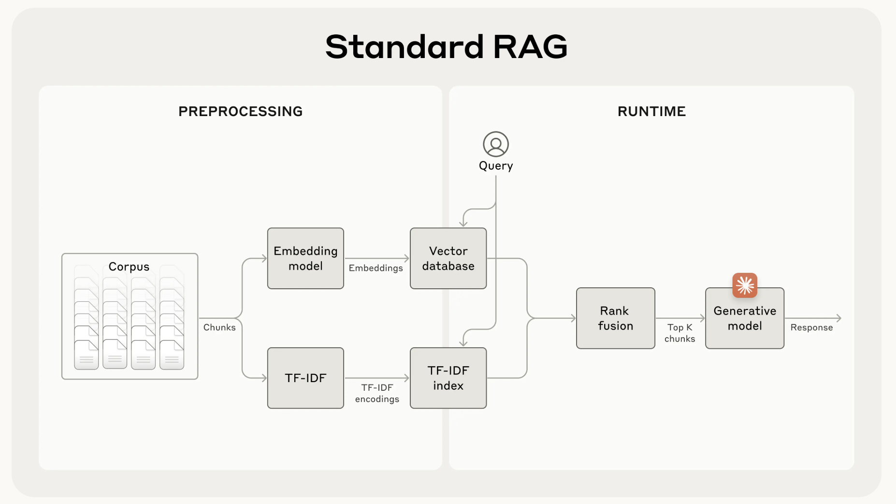
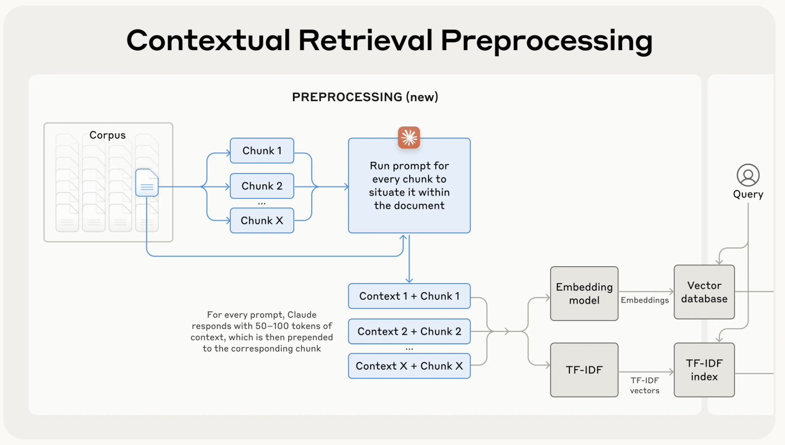
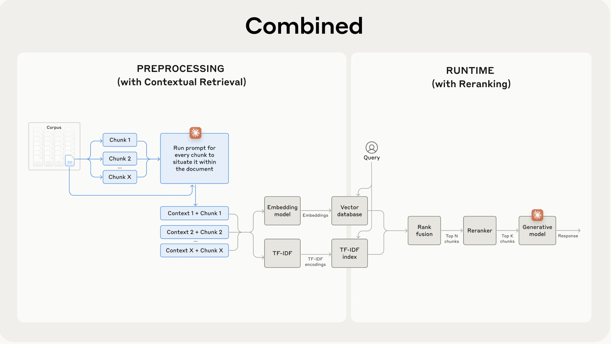

# Go to

article: https://www.anthropic.com/news/contextual-retrieval
link: https://github.com/anthropics/anthropic-cookbook/blob/main/skills/contextual-embeddings/guide.ipynb
bm25: https://www.elastic.co/blog/practical-bm25-part-2-the-bm25-algorithm-and-its-variables

We demonstrated how to use Contextual Embeddings to improve retrieval performance, then delivered additional improvements with Contextual BM25 and reranking.

# Notes on RAG

### Before trying RAG:

Sometimes the simplest solution is the best. If your knowledge base is smaller than 200,000 tokens (about 500 pages of material), you can just include the entire knowledge base in the prompt that you give the model, with no need for RAG or similar methods

### RAG steps

1. Break down the knowledge base (the “corpus” of documents) into smaller chunks of text, usually no more than a few hundred tokens;
2. Use an embedding model to convert these chunks into vector embeddings that encode meaning;
3. Store these embeddings in a vector database that allows for searching by semantic similarity.

At runtime, when a user inputs a query to the model, the vector database is used to find the most relevant chunks based on semantic similarity to the query. Then, the **most relevant chunks are added to the prompt** sent to the generative model.

### BM25! The benchmark

While embedding models excel at capturing semantic relationships, they can miss crucial exact matches. Fortunately, there’s an older technique that can assist in these situations. BM25 (Best Matching 25) is a ranking function that uses lexical matching to find precise word or phrase matches. It's particularly **effective for queries that include unique identifiers or technical terms**.

BM25 works by building upon the TF-IDF (Term Frequency-Inverse Document Frequency) concept. *TF-IDF measures how important a word is to a document in a collection*. BM25 refines this by considering document length and applying a saturation function to term frequency, which helps prevent common words from dominating the results.

RAG solutions can more accurately retrieve the most applicable chunks by combining the embeddings and BM25 techniques using the following steps:

Steps for RAG + BM25:

1. Break down the knowledge base (the "corpus" of documents) into smaller chunks of text, usually no more than a few hundred tokens;
2. Create TF-IDF encodings and semantic embeddings for these chunks;
3. Use BM25 to find top chunks based on exact matches;
4. Use embeddings to find top chunks based on semantic similarity;
5. Combine and deduplicate results from (3) and (4) using rank fusion techniques;
6. Add the top-K chunks to the prompt to generate the response.

But, **beware!**: RAG often destroys contexts when chunking the knowledge base/corpus.

### Enter contextual RAG

Contextual Retrieval solves this problem by prepending chunk-specific explanatory context to each chunk before embedding (“Contextual Embeddings”) and creating the BM25 index (“Contextual BM25”).

### Implementation considerations
When implementing Contextual Retrieval, there are a few considerations to keep in mind:

- **Chunk boundaries**: Consider how you split your documents into chunks. The choice of chunk size, chunk boundary, and chunk overlap can affect retrieval performance1.

- **Embedding model**: Whereas Contextual Retrieval improves performance across all embedding models we tested, some models may benefit more than others. We found Gemini and Voyage embeddings to be particularly effective.

- **Custom contextualizer prompts**: While the generic prompt we provided works well, you may be able to achieve even better results with prompts tailored to your specific domain or use case (for example, including a glossary of key terms that might only be defined in other documents in the knowledge base).

- **Number of chunks**: Adding more chunks into the context window increases the chances that you include the relevant information. However, more information can be distracting for models so there's a limit to this. We tried delivering 5, 10, and 20 chunks, and found using 20 to be the most performant of these options (see appendix for comparisons) but it’s worth experimenting on your use case.

**Always run evals**: Response generation may be improved by passing it the contextualized chunk and distinguishing between what is context and what is the chunk.

### Boost with re-ranking

The key steps are:

- Perform initial retrieval to get the top potentially relevant chunks (we used the top 150);
- Pass the top-N chunks, along with the user's query, through the reranking model;
- Using a reranking model, give each chunk a score based on its relevance and importance to the prompt, then select the top-K chunks (we used the top 20);
- Pass the top-K chunks into the model as context to generate the final result.

### Cost and latency considerations on re-ranking

One important consideration with reranking is the impact on latency and cost, especially when reranking a large number of chunks. Because reranking adds an extra step at runtime, it inevitably adds a small amount of latency, even though the reranker scores all the chunks in parallel. There is an inherent trade-off between reranking more chunks for better performance vs. reranking fewer for lower latency and cost. We recommend experimenting with different settings on your specific use case to find the right balance.

### General conclusions

1. Embeddings+BM25 is better than embeddings on their own;
2. Voyage and Gemini have the best embeddings of the ones we tested;
3. Passing the top-20 chunks to the model is more effective than just the top-10 or top-5;
4. Adding context to chunks improves retrieval accuracy a lot;
5. Reranking is better than no reranking;
6. All these benefits stack: to maximize performance improvements, we can combine contextual embeddings (from Voyage or Gemini) with contextual BM25, plus a reranking step, and adding the 20 chunks to the prompt.

